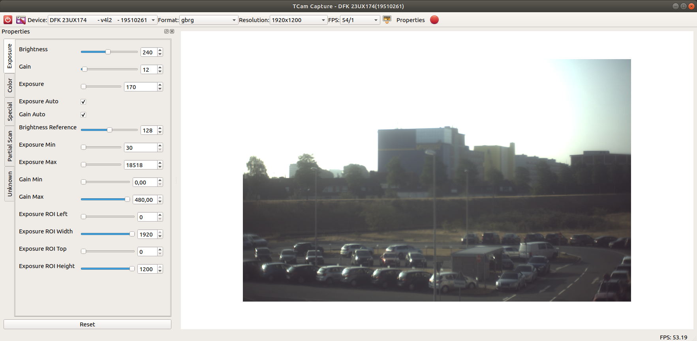
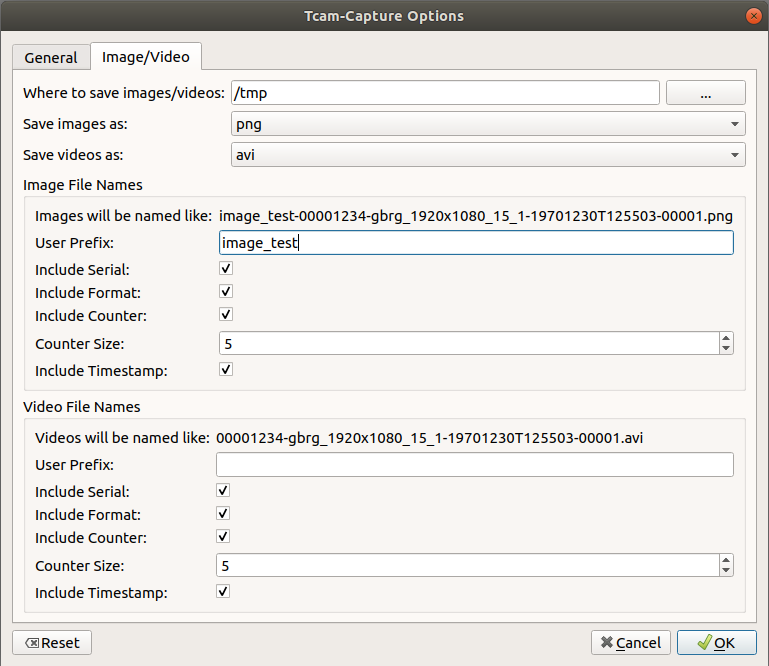
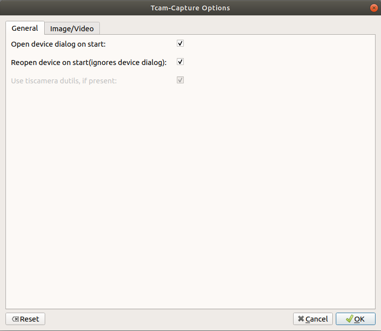

.. _tcam-capture:

############
tcam-capture
############

tcam-capture is the general purpose image retrieval application of The Imaging Source under Linux.

=====================
Commandline Arguments
=====================

tcam-capture has several optional arguments to change its behavior:

-h, --help           Show this help message and exit
--serial SERIAL      Open device with serial immediately
--format CAPS_STR    Open device with this gstreamer format
--verbose, -v        Increase logging level
--reset              Reset application settings and clear cache
--fullscreen         Start the application in fullscreen mode

Additionally  gstreamer arguments can be passe to retrieve debug information about the streams.
Currently supported are

.. code-block:: text

    --gst-debug
    --gst-debug-level
    --gst-debug-no-color

For more information concerning gstreamer debugging go here: :ref:`logging`

=======
Options
=======

tcam-capture offers several options to change its behavior.
The configuration file can be found under `$XDG_CONFIG_DIR/tcam-capture.conf`.

**Default** : `~/.config/tcam-capture.conf`

Image/Video
===========

Save Location
-------------

Default: /tmp

Folder in which images/videos shall be saved.

Image Type
----------

Image encoding that shall be used when saving images.

_Default_: png

Video Type
----------

_Default_: avi

Video encoding that shall be used when saving videos.

Naming Options
--------------

The available options are identical for images and videos.

:User Prefix:
   Random string defined by the user that is prepended to the
   file name. The maximum length is 100 characters
   Default: Empty
:Include Serial:
   Adds the serial number of the used device to the filename
   Default: True
:Include Format:  Include a simple format description.
                  This description contains all information concerning the currently used device caps.
                  The string will have the format:
                  ``format_widthxheight_framerate-numerator_framerate-denominator``
                  To ensure the file can be saved characters like '/' are replaced with underscores.
                  Default: True
:Include Counter:  Include a unique counter in the filename. If the
                   application is restarted the counter will pickup where it left, assuming all
                   other parts of the name remain identical.
                   Default: True
:Counter Size:  Size of the padding the counter shall have
                Maximum: 10
                Default: 5
:Include Timestamp:  Include a timestamp with local time in the
                     filename. The timestamp will be in ISO format i.e. YYYYmmddTHHMMSS.
                     When both timestamp and counter are active, the counter
                     will be reset once the timestamp changes.
                     Default: True

General
=======

Show Device Dialog On Startup
    Whether or not to show the device selection dialog on startup.
    Will be ignored when a device shall be reopened.
    Default: True

Reopen Device On Startup:
  When a device was open during the last application shutdown, tcam-capture will
  automatically try to reopen the device. If the device does not exist it will
  fall back to its default behavior.
  Default: True

Use Dutils:
  A toggle to disable the usage of tiscamera-dutils.
  The package tiscamera-dutils will have to be installed for this to be enabled.
  Default: True

=======
Caching
=======

tcam-capture has a cache directory that can be found at
`$XDG_CACHE_DIR/tcam-capture/`.

The default is: `~/.cache/tcam-capture/`
